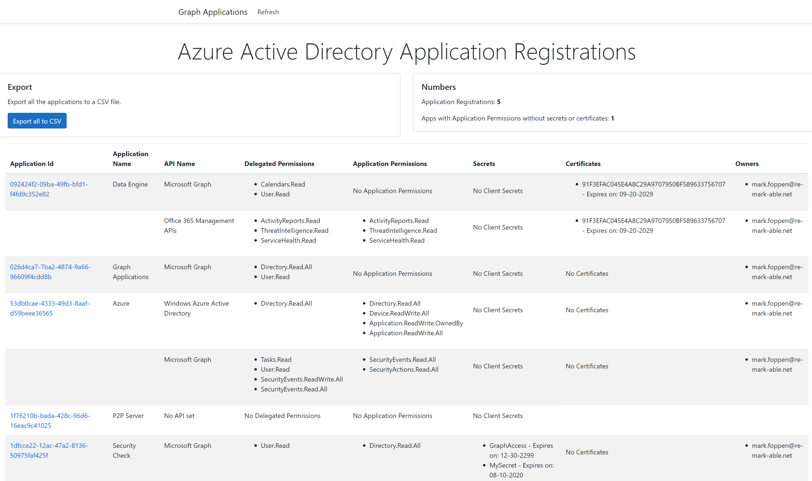

# Microsoft Graph API AAD Application Registrations Demo 

## Table of contents

- [Introduction](#introduction)
- [Prerequisites](#prerequisites)
- [Getting started](#getting-started-with-sample)
- [Register the application](#register-the-application)
- [Grant Admin consent to view Directory data](#grant-admin-consent-to-view-directory-data)
- [Build and run the sample](#build-and-run-the-sample)
- [Deploy the sample to Azure](#deploy-the-sample-to-azure)
- [Demo App Walkthrough](#user-interface)
- [Comments or Issues](#comments-or-issues)

## Introduction

This demo app retrieves all the registered applications from your Azure Active Directory. For each registration, it also retrieves the permissions, expiration of secrets and certificates and the registered owner. The purpose of this demo is to get a quick inside into which permissions are assigned to every app.

Blog: Coming soon with an explanation of the code.

### Features
* Overview of all your Application Registrations
* View expiry date of Secrets and Certificates
* View registered Owner
* Direct deep-link to the specific application
* Export to CSV

## Prerequisites

This sample requires the following: 

 1. [Visual Studio 2017 or higher](https://www.visualstudio.com/en-us/downloads) 
 
## Getting started with the demo app

 1. Download or clone the source code from this repository.

### Register the application

1. Navigate to the [Azure portal > App registrations](https://go.microsoft.com/fwlink/?linkid=2083908) to register your app.

1. Select **New registration**.

1. When the **Register an application page** appears, enter your app's registration information:
    1. In the **Name** section, enter a meaningful name that will be displayed to users of the app. For example: `MyWebApp`
    1. In the **Supported account types** section, select **Accounts in this organizational directory only**.

1. Select **Register** to create the app.

1. On the app's **Overview** page, find the **Application (client) ID** value and record it for later. You'll need this value to configure it in the config file later.

1. From the **Certificates & secrets** page, in the **Client secrets** section, choose **New client secret**.
    1. Enter a key description (of instance `app secret`).
    1. Select a key duration of either **In 1 year**, **In 2 years**, or **Never Expires**.
    1. When you click the **Add** button, the key value will be displayed. Copy the key value and save it in a safe location.

 You'll need this key later to configure the project in Visual Studio. This key value will not be displayed again, nor retrievable by any other means, so record it as soon as it is visible from the Azure portal.

1. In the list of pages for the app, select **API permissions**.
    1. Click the **Add a permission** button and then make sure that the **Microsoft APIs** tab is selected.
    1. In the **Commonly used Microsoft APIs** section, select **Microsoft Graph**.
    1. In the **Application permissions** section, make sure that the following permissions are checked: **Directory.Read.All**. Use the search box if necessary.
    1. Select the **Add permissions** button.

## Grant Admin consent to view Directory data

### Assign Scope (permission)

1. Provide your Administrator the **Application Id** and the **Redirect URI** that you used in the previous steps. The organization’s Azure Active Directory Tenant Administrator is required to grant the required consent (permissions) to the application.
2. As the Tenant Administrator for your organization, open a browser window and paste the following URL in the address bar (after adding values for TENANT_ID, APPLICATION_ID, and REDIRECT_URL):
https://login.microsoftonline.com/TENANT_ID/adminconsent?client_id=APPLICATION_ID&state=12345&redirect_uri=REDIRECT_URL.

3. After authenticating, the Tenant Administrator will be presented with a dialog like the following (depending on the permissions the application is requesting)

4. By clicking on "Accept" in this dialog, the Tenant Administrator is granting consent to all users of this organization to use this application. Now this application will have the correct scopes (permissions) need to access the directory data for reading application registrations.

## Build and run the sample

1. Open the `GraphApplications.sln` project. 
2. To run locally, In appsettings.Development.json file, Enter the values for **TenantId**, **ClientId** and **ClientSecret** with the application ID and password that you copied during app registration. 
3. Run the application.

## Deploy the sample to Azure
Do **not** do this! Since we use a Client and Secret your Azure Active Directory Application Registrations will be publicly available because there is no sign-in required. In my opinion, you should run this demo app only on your local machine.

## User interface

## Comments or Issues
If you have any issues or comments, please let me know! This can be done by:
* Sending a DM to [@foppenma](https://twitter.com/foppenma) on twitter
* Creating an issue here on GitHub